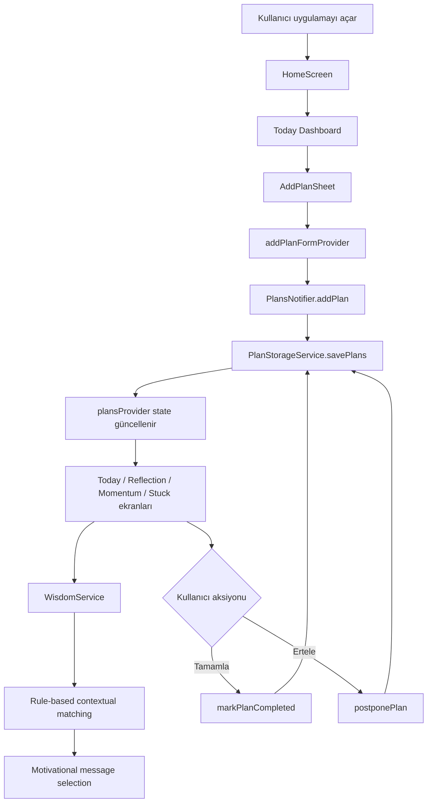

# Plan and Act

Plan and Act, kullanıcının gün içindeki hedeflerini hızlıca planlayıp uygulama içinde takip etmesini sağlayan bir Flutter mobil uygulamasıdır. Mevcut sürüm, "bugün odaklı" bir akışa sahiptir: plan ekleme, listeleme, tamamlama, erteleme ve bu bağlama göre `rule-based contextual matching` ile `motivational message selection`.

Bu noktada Wisdom Engine bir "quote generation" sistemi değildir. Uygulama, plan kategorisi ve erteleme geçmişi gibi sinyallere göre sabit bir içerik havuzundan uygun motivasyon mesajı ve alıntı seçer.

## Ürün Özeti

- Günlük planları tek ekranda görülebilir hale getirir.
- Kullanıcıya saat bazlı plan ekleme ve hızlı takip akışı sunar.
- Tamamlanan ve ertelenen planları ayrı görünümlerde toplar.
- Erteleme tekrarlarını izleyerek "stuck" sinyali üretir.
- Generative AI yerine kural tabanlı eşleştirme ile motivasyon mesajı seçer.

## Mevcut Deneyim

Uygulamanın bugünkü sürümü dört ana ekran etrafında şekilleniyor:

1. `Today Dashboard`: Bugünkü planlar, ilerleme oranı ve seçilen motivasyon mesajı.
2. `Reflection`: Tamamlanan ve ertelenen planların özet görünümü.
3. `Momentum`: Tamamlanan görevlere göre basit streak takibi.
4. `Stuck Detection`: Birden fazla kez ertelenen planları öne çıkarır.

## Ekran Görüntüleri ve Demo

Bu README artık medya odaklı bir yapıya hazır, ancak repo içinde gerçek ekran görüntüleri ve GIF/demo dosyaları henüz yok. Sahte ürün görüntüleri eklemedim; bunun yerine `docs/media/` altında net bir teslim listesi hazırladım.

Medya klasörü: [docs/media/README.md](docs/media/README.md)

Önerilen dosyalar:

| İçerik | Beklenen dosya |
| --- | --- |
| Today Dashboard ekran görüntüsü | `docs/media/today-dashboard.png` |
| Add Plan bottom sheet ekran görüntüsü | `docs/media/add-plan-sheet.png` |
| Reflection ekran görüntüsü | `docs/media/reflection-screen.png` |
| Momentum ekran görüntüsü | `docs/media/momentum-screen.png` |
| Stuck Detection ekran görüntüsü | `docs/media/stuck-screen.png` |
| Kısa demo GIF | `docs/media/planandact-demo.gif` |

README'ye gerçek görseller eklendikten sonra bu bölüm doğrudan görsel galerisine dönüştürülebilir.

## Kısa Kullanım Senaryosu

1. Kullanıcı sabah uygulamayı açar ve `Yeni Plan` butonuna dokunur.
2. Başlık, açıklama, kategori ve saat girerek bugün için bir plan oluşturur.
3. Plan, `Today Dashboard` içinde saat bazlı listede görünür.
4. Wisdom Engine, mevcut plan durumuna göre uygun bir motivasyon mesajı seçer.
5. Kullanıcı planı tamamlarsa `Reflection` ve `Momentum` görünümleri güncellenir.
6. Kullanıcı planı ertelerse görev bir sonraki güne kayar; tekrar eden ertelemelerde `Stuck Detection` bunu belirginleştirir.

## Akış Diyagramı



## Özellikler

1. `Plan ekleme`: Başlık, açıklama, kategori ve saat ile yeni plan oluşturma.
2. `Plan listeleme`: Planları zaman sırasına göre ana akışta gösterme.
3. `Durum güncelleme`: Planları tamamlama veya bir sonraki güne erteleme.
4. `Reflection view`: Tamamlanan ve ertelenen planları ayrı listeler halinde gösterme.
5. `Momentum view`: Tamamlanan görevlerden basit ilerleme ritmi çıkarma.
6. `Stuck detection`: Tekrar tekrar ertelenen görevleri öne çıkarma.
7. `Yerel kalıcılık`: Planları `SharedPreferences` ile cihazda saklama.
8. `Wisdom Engine`: Kural tabanlı eşleştirme ile alıntı ve motivasyon mesajı seçme.

## Mimari

Proje artık tek dosyalı bir yapı yerine feature bazlı ve katmanları ayrılmış bir organizasyona doğru ilerliyor:

```text
lib/
  app/
    app.dart
  features/
    plan_management/
      application/
        providers/
      data/
        datasources/
      domain/
        entities/
      presentation/
        screens/
        widgets/
    wisdom_engine/
      wisdom_service.dart
  main.dart
```

Katmanların mevcut sorumlulukları:

- `presentation`: Ekranlar, bottom sheet ve kullanıcı etkileşimi.
- `application`: Riverpod provider'ları ve UI ile veri akışı arasındaki durum yönetimi.
- `data`: `SharedPreferences` tabanlı yerel saklama.
- `domain`: `Plan` varlığı, kategori ve durum modelleri.
- `wisdom_engine`: Plan bağlamına göre kural tabanlı motivational message selection.

## Technology Stack

### Mevcut Durum

- `Flutter` + `Dart`
- `flutter_riverpod`
- `shared_preferences`
- `flutter_local_notifications` ve `timezone`
- Material 3 tabanlı koyu tema

### Bugün Gerçekte Olanlar

- State management artık yalnızca `setState` değil; veri akışı Riverpod provider'ları ile yürütülüyor.
- Alt gezinme ile çoklu ekran akışı mevcut.
- Bildirim bağımlılıkları projeye eklenmiş durumda, ancak plan oluşturma/güncelleme/silme yaşam döngüsüne tam bağlı bir notification akışı yok.
- Wisdom Engine generative değil; sabit kural seti üzerinden seçim yapıyor.

### Hedef Mimari

- Notification scheduling ve cancellation akışını plan yaşam döngüsüne bağlamak.
- Repository soyutlamalarıyla veri erişim katmanını daha netleştirmek.
- İhtiyaca göre cloud sync için backend adaptörü eklemek.
- Wisdom Engine'i daha esnek bir recommendation katmanına taşımak.

## Kurulum

1. Flutter SDK'nin kurulu olduğundan emin olun.
2. Depoyu klonlayın:

   ```bash
   git clone <repo-url>
   cd Plan-and-Act
   ```

3. Bağımlılıkları yükleyin:

   ```bash
   flutter pub get
   ```

4. Uygulamayı çalıştırın:

   ```bash
   flutter run
   ```

5. Analiz ve test:

   ```bash
   flutter analyze
   flutter test
   ```

## Known Limitations

- Plan oluşturma akışında tarih seçimi yok; mevcut akışta planlar bugün için oluşturuluyor.
- Plan düzenleme ve silme henüz uygulanmadı.
- `flutter_local_notifications` ve `timezone` bağımlılıkları mevcut, ancak uçtan uca bildirim akışı tamamlanmadı.
- Wisdom Engine gerçek zamanlı öğrenme, semantic analysis veya LLM tabanlı üretim yapmıyor.
- Veriler yalnızca cihazda tutuluyor; cihazlar arası senkronizasyon yok.
- README medya yapısı hazırlandı, fakat gerçek ekran görüntüleri ve demo GIF henüz eklenmedi.

## Roadmap

- [x] Temel plan oluşturma ve listeleme
- [x] Yerel depolama ile kalıcılık
- [x] Riverpod tabanlı temel state katmanı
- [x] Reflection, Momentum ve Stuck ekranları
- [x] Rule-based motivational message selection
- [ ] Plan düzenleme / silme akışları
- [ ] Uçtan uca zamanlanmış bildirim altyapısı
- [ ] Tarih bazlı planlama ve filtreleme
- [ ] Bulut senkronizasyonu ve kullanıcı hesabı altyapısı
- [ ] README için gerçek ekran görüntüleri ve demo GIF
